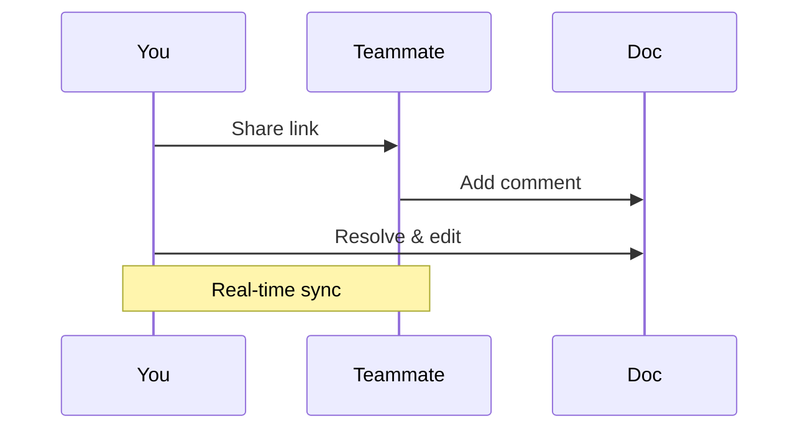

## Overview

SHR Creative Studio provides powerful tools to streamline your documentation workflow. You organize projects efficiently, manage documents with version control, collaborate seamlessly with teams, and customize your space to fit your needs. These core features help you create professional documentation hubs quickly.

<Columns cols={2}>
  <Card title="Project Organization" icon="folder" href="#project-organization">
    Structure your docs with folders, tags, and search.
  </Card>
  <Card title="Document Management" icon="file-text" href="#document-management">
    Handle versions, drafts, and publishing workflows.
  </Card>
  <Card title="Collaboration" icon="users" href="#collaboration">
    Share, comment, and edit in real-time.
  </Card>
  <Card title="Customization" icon="palette" href="#customization">
    Tailor themes, templates, and integrations.
  </Card>
</Columns>

## Project Organization

Organize your documentation into intuitive hierarchies. Create nested folders to group related docs, apply tags for quick filtering, and use full-text search to find content instantly.

<Callout kind="tip">
  Start by creating a root folder for each project to maintain clean separation.
</Callout>

### Setting Up Folders and Tags

Follow these steps to organize your first project:

<Steps>
  <Step title="Create a Project Folder" icon="folder-plus">
    Navigate to your workspace dashboard and click `New Folder`. Name it after your project, such as `Q4-Launch-Docs`.
  </Step>
  <Step title="Add Tags" icon="tag">
    Open a document, select the `Tags` panel, and add labels like `draft`, `review`, or `published`.
  </Step>
  <Step title="Search and Filter" icon="search">
    Use the global search bar to query by keyword or tag. Results appear with previews.
  </Step>
</Steps>

## Document Management

Manage documents with robust version history. Track changes, restore previous versions, and schedule publishes directly from the editor.

<Tabs>
  <Tab title="Version Control" icon="git-branch">
    Every edit creates an automatic snapshot. View history via the `Versions` tab.

    ```yaml
    versions:
      - id: v1.0
        date: 2024-10-01
        changes: Initial draft
      - id: v1.1
        date: 2024-10-05
        changes: Added API section
    ```
  </Tab>
  <Tab title="Draft Workflow" icon="edit-3">
    Toggle between draft and published modes. Preview changes before going live.
  </Tab>
</Tabs>

## Collaboration Features

Invite team members to collaborate in real-time. Assign roles, leave inline comments, and resolve feedback efficiently.



<Expandable title="Advanced Permissions" default-open="false">
  Set granular roles: Viewer (read-only), Editor (full access), Admin (manage users).

  | Role     | Edit Docs | Manage Users | Publish |
  |----------|-----------|--------------|---------|
  | Viewer   | No        | No           | No      |
  | Editor   | Yes       | No           | Yes     |
  | Admin    | Yes       | Yes          | Yes     |
</Expandable>

## Customization Options

Tailor your studio with custom themes, templates, and embeds. Apply your brand colors like `#3B82F6` and integrate external tools.

<CodeGroup tabs="Theme Config,Template Example">
  ```yaml
  theme:
    primaryColor: "#3B82F6"
    font: "Inter"
    sidebar:
      collapsed: true
  ```
  ```html
  <!-- Custom template -->
  <header>
    <h1>SHR Creative Studio</h1>
    <nav>Quick links</nav>
  </header>
  ```
</CodeGroup>

<Callout kind="info">
  Explore the `Customization` panel in settings to preview changes live.
</Callout>

Ready to dive deeper? Check the [quickstart guide](/quickstart) for hands-on setup.