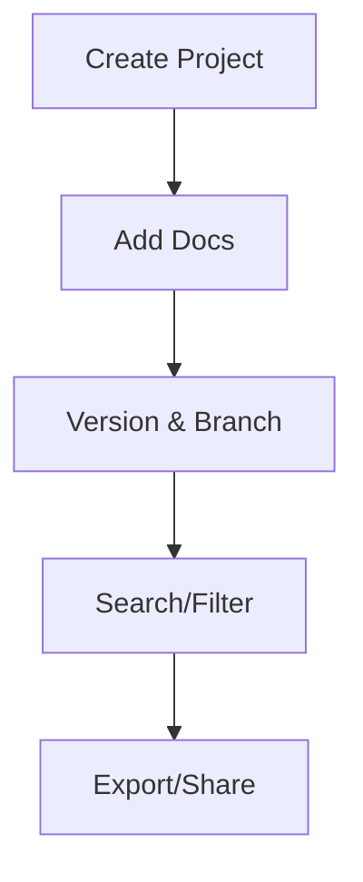

## Overview

SHR Creative Studio provides powerful tools to manage your projects and documentation. You create structured spaces for organizing content, track changes with versioning, search efficiently, and export when needed. This guide covers essential workflows to keep your documentation organized and up-to-date.

<Callout kind="info">
  Start with a clear project structure to avoid clutter as your documentation grows.
</Callout>

## Creating and Editing Projects

Begin by creating a new project space tailored to your needs, such as a marketing campaign or product launch.

<Steps>
  <Step title="Create Project" icon="plus">
    Navigate to the dashboard and click "New Project".

    ```

    bash
    shr create project "Q4 Marketing Campaign" --template docs
    ```
  </Step>
  <Step title="Add Documentation" icon="file-text">
    Upload or create MDX files directly in the editor.

    <Columns cols={2}>
      <Card title="Visual Editor" icon="edit-3" href="#visual-editor">
        Drag-and-drop interface for quick edits.
      </Card>
      <Card title="Code Editor" icon="code" href="#code-editor">
        Full syntax highlighting for MDX.
      </Card>
    </Columns>
  </Step>
  <Step title="Save Changes" icon="save">
    Commit edits with a descriptive message.
  </Step>
</Steps>

Edit projects anytime via the project sidebar. Use the real-time preview to ensure components like `<Callout>` render correctly.

## Document Versioning

Versioning tracks changes automatically, allowing rollbacks and collaboration.

| Feature | Description | Benefits |
|---------|-------------|----------|
| Auto-save | Saves every 30 seconds | Prevents data loss |
| Branching | Create feature branches | Test changes safely |
| Rollback | Revert to any version | Quick recovery |

<Expandable title="Advanced Versioning Workflow" default-open="false">
  For teams, enable branching:

  ```

  bash
  shr branch create "feature/dark-mode"
  shr merge "feature/dark-mode" --main
  ```
</Expandable>

## Search and Filtering

Quickly find content using powerful search tools.

<Tabs>
  <Tab title="Global Search" icon="search">
    Search across all projects by keyword.

    ```

    bash
    shr search "API integration" --project "Q4 Campaign"
    ```
  </Tab>
  <Tab title="Filters" icon="filter">
    Filter by tags, date, or author.

    Example filters:
    - `status:active`
    - `tag:guide`
    - `updated:>2024-01-01`
  </Tab>
</Tabs>

## Exporting Content

Export your documentation for sharing or backups.

<CodeGroup tabs="CLI,UI">
  ```bash
  shr export "Q4 Campaign" --format pdf --output ./exports/
  shr export "Q4 Campaign" --format mdx --zip
  ```
  ```mdx
  In the UI:
  1. Select project
  2. Choose Export > PDF/MDX/ZIP
  3. Download
  ```
</CodeGroup>

<Callout kind="tip">
  Schedule automated exports via webhooks to `https://your-webhook-url.com/export` for CI/CD pipelines.
</Callout>

## Best Practices

- Organize projects hierarchically: Use folders like `/guides/`, `/api/`.
- Tag documents consistently: `["guide", "reference"]`.
- Review versions weekly to merge branches.



Follow these steps to maintain scalable documentation in SHR Creative Studio.